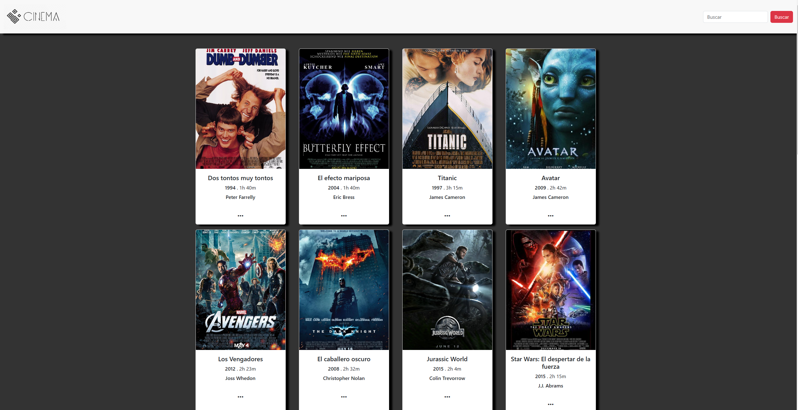

# Movie Billboard

## Description

This project is a **movie billboard** application built with HTML5, CSS, JavaScript, and JSON. The app displays a list of movies along with details like the title, release date, description, and a poster image for each movie. The movie data is stored in JSON files and dynamically loaded into the webpage using JavaScript, creating an interactive and easy-to-navigate interface.

## Screenshots

  
*Example of the user interface of the movie billboard.*

## Features

- Display a list of movies with information such as title, release date, and description.
- Dynamic loading of movie data from JSON files.
- Responsive design for mobile and desktop compatibility.
- Styled with animations and customized themes for a visually appealing interface.

## Technologies Used

- **HTML5**: Defines the structure of the web page.
- **CSS**: Provides styling and layout for the app.
- **JavaScript**: Handles DOM manipulation and dynamic data loading.
- **JSON**: Stores and structures the movie data.

## Project Structure

Here is the basic folder structure of the project:

